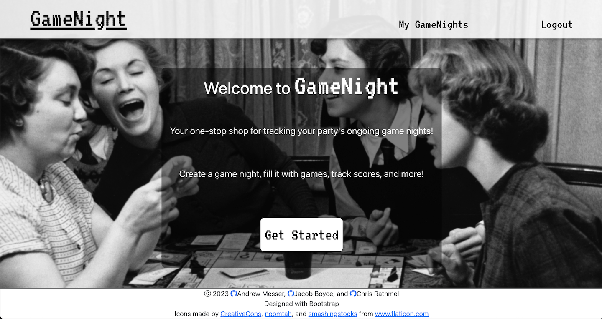

# GameNight

## Description

GameNight is a MERN (MongoDB, Express, React, Node.js) application that allows users to create and manage game nights. It leverages GraphQL for efficient and flexible data querying. The application enables users to create an account, create game nights, and track game details including participants, games played, scores, outcomes, and notes. Additionally, GameNight provides a panel of interactive widgets such as a dice roll feature, a timer feature, and a randomizer feature to enhance the gaming experience.

## Table of Contents

- [Features](#features)
- [Usage](#usage)
- [Technologies](#technologies)
- [Contributing](#contributing)
- [License](#license)

## Features

- User authentication: Users can create an account to access GameNight.
- Game night creation: Users can create game nights by providing a description, listing participants, and adding games played.
- Interactive game table: Each game includes an interactive table to track scores and outcomes. Users can update scores and add notes about the game.
- Widget panel: GameNight provides a panel of widgets including a dice roll feature, a timer feature, and a randomizer feature

## Usage

Vist the application at: [https://game-night-1.herokuapp.com/](https://game-night-1.herokuapp.com/)

1. Create an account or log in to your existing account.
2. Click on "Create GameNight" to create a new game night.
3. Fill in the necessary details such as description, participants, and games played.
4. For each game, update the scores and add any notes.
5. Use the interactive table to track the game progress and outcomes.
6. Utilize the widgets panel for dice rolls, timers, and randomizers.

## Technologies

GameNight is built using the following technologies:

- MongoDB: A NoSQL database used to store user and game data.
- Express: A minimal and flexible Node.js web application framework.
- React: A JavaScript library for building user interfaces.
- Node.js: A JavaScript runtime environment used for server-side development.
- GraphQL: A query language and runtime for APIs.
- HTML5: The markup language used for structuring and presenting content.
- CSS3: The stylesheet language used for styling the application.
- JavaScript: The programming language used for client-side and server-side scripting.

## Contributing

To contribute, follow these steps:

1. Fork the repository.
2. Create a new branch.
3. Make your changes.
4. Test your changes.
5. Submit a pull request.

Please ensure your pull request adheres to the project's code style and guidelines.

## License

[ISC License](https://opensource.org/license/isc-license-txt/)
